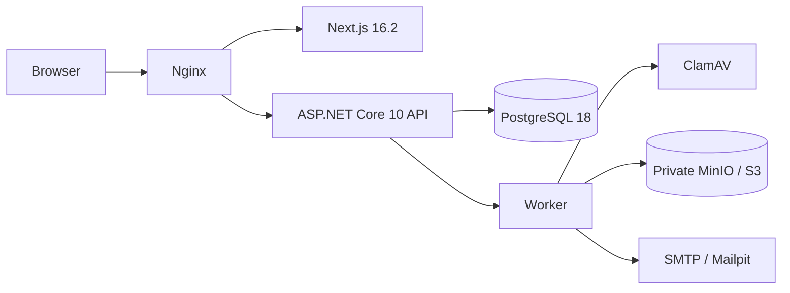
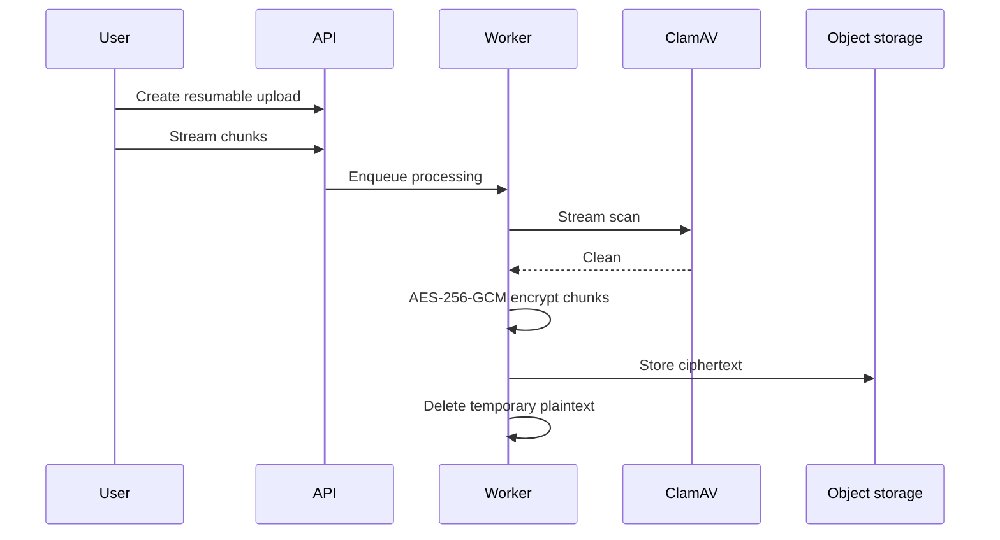

# VaultShare

> A privacy-focused secure file sharing platform with encrypted storage,
> expiring links, password protection, download limits, malware scanning,
> audit logs, and workspace collaboration.


VaultShare adalah modular monolith untuk berbagi file bagi individu dan tim.
Target keamanannya adalah *application-level encryption at rest* dengan
dekripsi yang dikendalikan server. VaultShare bukan end-to-end encryption dan
tidak mengklaim kebal terhadap seluruh serangan.

## Status dan demo

Core identity/workspace, resumable upload, fail-closed processing, chunked
encryption, public/internal share, atomic download reservation, safe preview,
audit, notification, retention, dan dashboard telah diimplementasikan. Stack
Compose, permission non-root, empat skenario browser, dan smoke pipeline
terenkripsi 1 MiB telah diverifikasi di host lokal. Lihat
[STATUS.md](STATUS.md) dan [TASKS.md](TASKS.md) untuk bukti terkini.

Screenshot tersedia di [screenshots/](screenshots/) — diambil dari Next.js dev server
yang berjalan melalui Playwright, menunjukkan landing page dan UI component states.

## Masalah dan solusi

Layanan berbagi file biasa sering mengandalkan URL panjang, bucket publik, atau
kontrol akses yang hanya terlihat di UI. VaultShare merancang otorisasi di API,
token share yang hanya disimpan sebagai hash, ciphertext-only object storage,
malware scanning fail-closed, dan audit dengan redaksi data sensitif.

## Fitur yang tersedia

- Personal dan team workspace dengan Owner, Admin, Member, dan Viewer.
- Cookie authentication, CSRF defense, email verification, session controls,
  lockout, TOTP 2FA, dan recovery codes.
- Chunked/resumable streaming upload dengan quota dan content validation.
- ClamAV scanning serta envelope encryption AES-256-GCM per file.
- Share publik/internal dengan expiration, password, maximum download,
  one-time semantics, preview policy, dan revoke.
- Streaming authenticated decryption tanpa direct public object URL.
- Audit, notifications, retention, purge, dan crypto-shredding semantics.

## Security highlights

- Raw share token, password, plaintext DEK, dan KEK tidak disimpan di database.
- Filename tidak digunakan sebagai object key atau filesystem path.
- Scanner error bukan hasil clean; production bersifat fail closed.
- Public share path diredaksi dari proxy access log dan tidak memakai analytics.
- Download slot akan direservasi atomik saat stream dimulai; slot tidak
  dikembalikan saat klien terputus untuk membatasi abuse.

Desain rinci tersedia di [docs/threat-model.md](docs/threat-model.md),
[docs/encryption-design.md](docs/encryption-design.md), dan
[docs/architecture.md](docs/architecture.md).

## Arsitektur dan stack



Backend mengikuti Domain → Application → Infrastructure dengan API/Worker
sebagai composition roots. Frontend adalah aplikasi Next.js terpisah. V1 tetap
modular monolith; tidak memakai microservices atau Kubernetes.

## Alur file



## Requirements

- Docker Engine dengan Compose plugin (jalur yang direkomendasikan).
- Untuk manual development: .NET SDK 10.0.301 dan Node.js 24 LTS.
- Minimum 4 GB RAM; ClamAV signature startup dapat memerlukan beberapa menit.

## Quick start dengan Docker

```bash
cp .env.example .env
# Generate dua key 32-byte yang berbeda, lalu isi FILE_ENCRYPTION_KEK dan
# PRIVACY_IP_HASH_KEY di .env.
openssl rand -base64 32
openssl rand -base64 32
docker compose up --build --wait
```

Aplikasi: `http://localhost:8080`; Mailpit: `http://localhost:8025`; MinIO
console: `http://localhost:9001`. Credential `.env.example` hanya untuk local.

## Manual development

```bash
dotnet restore backend/VaultShare.sln
dotnet build backend/VaultShare.sln --no-restore
dotnet run --project backend/src/VaultShare.Api
dotnet run --project backend/src/VaultShare.Worker
cd frontend
npm ci
npm run dev
```

Development API menjalankan migration dan seeder secara idempotent bila
`SEED_DEMO_DATA=true`. Untuk migration-only (termasuk production rollout):

```bash
dotnet run --project backend/src/VaultShare.Api -- --migrate-only
```

Seeder demo membuat ciphertext fixture sungguhan di object storage; production
startup menolak `SEED_DEMO_DATA=true`. Status migration aktual dicatat di
`STATUS.md`.

PostgreSQL, private MinIO bucket, ClamAV, dan Mailpit dikonfigurasi oleh Compose.
MinIO init secara eksplisit menonaktifkan anonymous bucket access.

## Tests

```bash
dotnet test backend/VaultShare.sln -m:1
cd frontend
npm run lint
npm run typecheck
npm test
npm run build
# Dengan full Compose sehat:
npm run test:e2e
npm run test:performance
```

Integration API in-process berjalan tanpa Docker; Compose dan browser tests
memerlukan Docker. Detail ada di
[docs/testing.md](docs/testing.md).

## Demo accounts

Seeder local/demo membuat `owner@example.com`, `admin@example.com`,
`member@example.com`, dan `viewer@example.com` (beserta akun role tambahan)
dengan password `ChangeMe123!`. Akun demo hanya dibuat ketika
`SEED_DEMO_DATA=true` di Development dan tidak pernah di Production.

## Production, key management, dan recovery

Jangan gunakan credential local. Production harus memakai HTTPS, secret
manager, private database dan bucket, ClamAV fail-closed, SMTP yang
terverifikasi, backup terenkripsi, dan restore drill. Mengganti KEK dilakukan
dengan command worker `rewrap-keys` untuk me-*rewrap* DEK tanpa mengenkripsi
ulang ciphertext. Gunakan dry-run dan batch sesuai runbook.

Lihat [deployment](docs/deployment.md), [key management](docs/key-management.md),
[disaster recovery](docs/disaster-recovery.md), dan [production hardening](docs/production-hardening.md).

## Batasan keamanan

Server memiliki kemampuan dekripsi; kompromi API dan KEK dapat membuka file.
Secure deletion dibatasi oleh versioning, snapshot, lifecycle, dan retensi
backup provider. Scanning mengurangi risiko malware tetapi tidak menjamin file
aman. ZIP bundle adalah non-goal V1; strict mid-stream revoke, E2EE klien,
multi-region, cloud-KMS provider, dan mobile native juga berada di luar V1.

## Kontribusi, security, roadmap, license

Lihat [CONTRIBUTING.md](CONTRIBUTING.md). Vulnerability sensitif dilaporkan
sesuai [SECURITY.md](SECURITY.md), bukan public issue. Roadmap dikelola di
[TASKS.md](TASKS.md). Proyek berlisensi [MIT](LICENSE).
