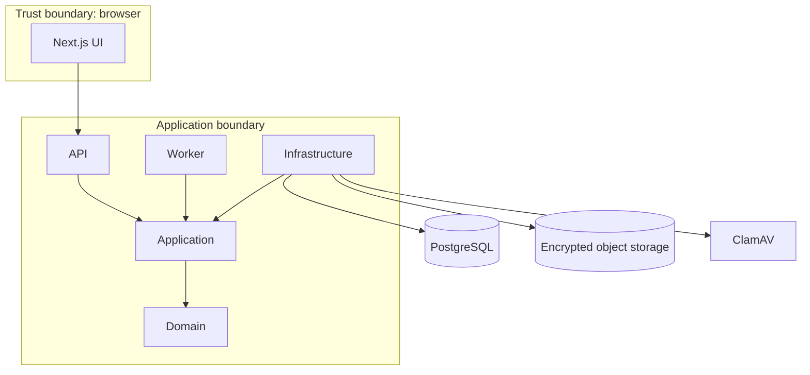

# Architecture

VaultShare adalah modular monolith dengan deployment API, worker, dan frontend
terpisah. Domain bebas dari infrastructure; Application mendefinisikan use case
dan port; Infrastructure mengimplementasikan persistence, storage, crypto,
scanner, email, dan jobs; API/Worker hanya composition roots.

Public identifiers use UUID; secrets use independent random tokens. Workspace
scope is enforced in database queries and authorization policies, never only in
the frontend.
