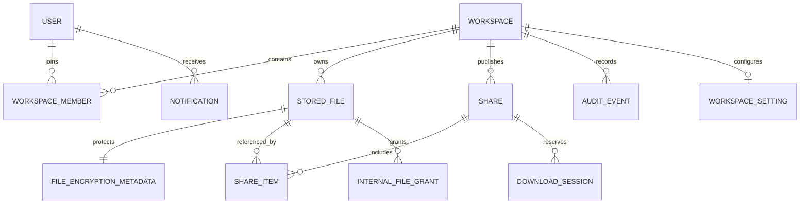

# Data Model

Core aggregates are User/Session, Workspace/Member/Invitation, StoredFile/
FileUpload/EncryptionMetadata, Share/ShareItem/AccessAttempt/DownloadSession,
Audit/SecurityEvent/Notification, and Retention/Deletion records. Public IDs are
UUID, timestamps are UTC, workspace foreign keys are mandatory where relevant,
and optimistic concurrency protects mutable share/download counters.

PostgreSQL migrations mencakup Identity/session/workspace/invitation, upload dan
file lifecycle, encryption metadata, malware scan result, secure share/download,
access attempts, append-only audit, notification, internal grants, retention
state, dan workspace settings. Constraints memvalidasi ukuran/offset/expiry,
download limits, quota, dan retention range. Migration apply tetap harus
diverifikasi pada runtime PostgreSQL nyata.
