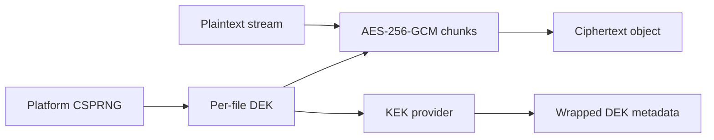

# Encryption Design

The implemented `VSH1` format uses chunked AES-256-GCM with a fresh 256-bit DEK
and 64-bit random nonce prefix per file. A 32-bit big-endian chunk index completes
the 96-bit GCM nonce, so a nonce cannot repeat under the same DEK. Associated data
contains file ID, algorithm version, and chunk index. Every record stores its own
16-byte authentication tag, which is verified before that chunk is written to the
download stream.

The DEK is wrapped separately with AES-256-GCM under the configured KEK. Database
metadata stores only the wrapped DEK, wrapping nonce/tag, non-secret key identifier,
algorithm version, chunk size, and base nonce. The KEK is read from the environment
provider and is never stored in the database. Platform `RandomNumberGenerator` and
`System.Security.Cryptography.AesGcm` are used; VaultShare defines a container
format, not a new cipher.

Current limits: chunks are 4 KiB–8 MiB and the processing pipeline uses 1 MiB.
The 32-bit chunk index bounds one encrypted object to roughly 4 PiB at that size,
well above the configured upload limit. Authentication failure aborts decryption.
