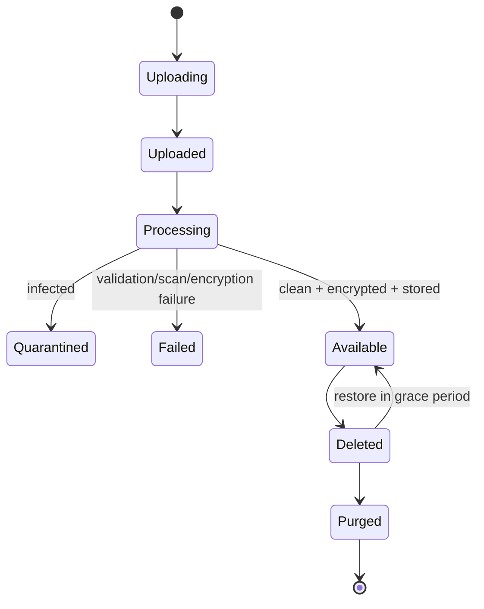

# File Processing Pipeline

```mermaid
stateDiagram-v2
  [*] --> Uploading
  Uploading --> Uploaded
  Uploaded --> Processing
  Processing --> Quarantined: infected
  Processing --> Failed: validation/scan/encryption failure
  Processing --> Available: clean + encrypted + stored
  Available --> Deleted
  Deleted --> Available: restore in grace period
  Deleted --> Purged
  Purged --> [*]
```

Temporary plaintext stays in a non-public bounded area and is deleted after
ciphertext persistence. Sharing is disabled until state `Available`.

