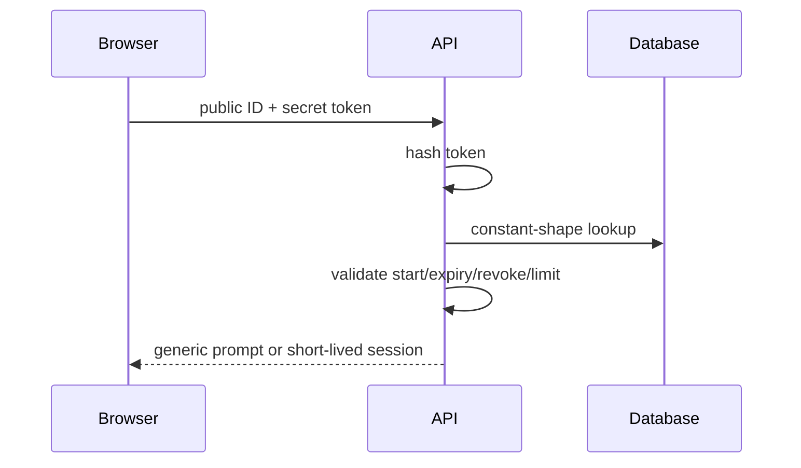

# Share Link Security

URL shape is `/s/{publicIdentifier}/{secretToken}`. The identifier is not a
secret; the independent high-entropy URL-safe token is shown once and stored
only as a cryptographic hash. Passwords use ASP.NET Core PasswordHasher and
successful verification creates a short-lived share-bound authorization
session. Password and discovery endpoints receive layered rate limits.

