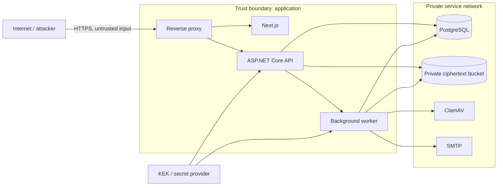

# Threat Model

Versi model: 1.0, metode STRIDE. Model ini menggambarkan kontrol yang ada pada
repository, bukan jaminan bahwa deployment tertentu aman. Review harus diulang
setelah perubahan trust boundary, key provider, object storage, atau proxy.

## Asset dan aktor

Asset utama: plaintext sementara dan saat streaming, ciphertext, secret share,
password share, cookie/session, KEK, wrapped DEK, membership, audit data,
notification metadata, database backup, dan konfigurasi production. Aktor yang
dipertimbangkan: anonymous attacker, bot, user terautentikasi berbahaya, member
workspace berbahaya, browser/database/object storage yang dikompromikan,
infrastructure insider, network attacker, malware uploader, serta dependency
upstream yang dikompromikan.

## Threat register

| Threat | STRIDE | Risiko / dampak | Kontrol yang diterapkan | Residual risk | Regression/evidence |
|---|---|---|---|---|---|
| Share token guessing | S | Tinggi; akses publik ilegal | 256-bit CSPRNG, identifier terpisah, hash-only database, expiry, IP/share throttling | Token dapat dicuri dari browser penerima | `SecureShareDownloadTests` |
| Password brute force | S | Tinggi | Identity password hasher, pesan generik, lima kegagalan/15 menit, endpoint rate limit | Bot terdistribusi | access-attempt integration tests |
| Session theft/replay | S | Tinggi | HttpOnly/Secure/SameSite cookies, short-lived share session terikat share, session revoke | Browser/device compromise | session and 2FA tests |
| IDOR / workspace leak | E/I | Kritis | Membership query backend, role policy, DTO shaping, internal grant tetap same-workspace | Defect query baru | workspace isolation/internal grant tests |
| Admin mengambil owner | E | Tinggi | Owner tidak dapat dihapus oleh Admin; ManageSecurity hanya Owner | Compromised Owner | `WorkspaceRoleTests` |
| File overwrite | T | Tinggi | random object key, create-new temp file, offset concurrency token, object existence guard | UUID collision/library defect | upload tests |
| Path traversal/null byte | T | Tinggi | leaf-only sanitized display name, null-byte reject, filename tidak menjadi path/key | Unicode display ambiguity | upload/security tests |
| MIME spoofing | T | Tinggi | magic-byte/content inspection, allowlist preview, `nosniff` | Polyglot baru | `Mime_spoofing_fails_closed` |
| Malware upload | T | Tinggi | ClamAV INSTREAM, timeout, scanner error tidak pernah clean, quarantine | Zero-day/AV evasion | fake outcome tests; real scanner needs Docker |
| Stored XSS | T | Tinggi | React escaping, text preview `text/plain`, no HTML/SVG/script preview, CSP | Browser parser defect | component/security regression |
| Header injection filename | T | Tinggi | control-char sanitization, framework `ContentDispositionHeaderValue` | Framework defect | download header tests |
| Secret logging | I | Kritis | request body tidak dibaca logger, `/s/` proxy logging off, audit safe metadata, no raw URL analytics | Sink eksternal salah konfigurasi | audit redaction tests/config review |
| Database disclosure | I | Tinggi | secret token hash, password hash, wrapped—not plaintext—DEK | DB + KEK/API compromise | hash-only/encryption tests |
| Object storage disclosure | I | Tinggi | bucket private, application-level AES-GCM ciphertext, no direct public/presigned download | API + KEK compromise | ciphertext inspection tests |
| KEK compromise | I/E | Kritis | KEK only config/secret provider, startup validation, rewrap interface and command | Host compromise exposes decrypt capability | key wrap/rotation tests and runbook |
| Backup disclosure | I | Tinggi | ciphertext object backup, encrypted DB backup recommendation, KEK separate | Operator copies plaintext config | disaster-recovery checklist |
| Download-limit race | T/E | Tinggi | serializable transaction/optimistic concurrency plus reservation-at-start | Multi-node lock depends on PostgreSQL transaction | concurrent one-time test |
| Duplicate finalize/share | T | Sedang | idempotency keys and unique database constraints | Lost response cannot redisplay share secret | upload/share replay tests; ADR |
| Revoke race | T | Sedang | new sessions denied immediately; started stream allowed to finish | Existing stream completes | documented access policy |
| CSRF | T | Tinggi | antiforgery header/cookie on authenticated unsafe requests; same-site cookies | Same-site XSS bypasses CSRF | auth/security tests |
| CORS misconfiguration | I | Tinggi | explicit origins/methods/headers, credentials, production HTTPS guard | Proxy may add its own headers | CORS security test |
| Open redirect | S | Sedang | no client-controlled redirect target | Future endpoint may introduce it | security regression backlog |
| SSRF | I/T | Tinggi | service endpoints only from trusted startup configuration; no URL fetch feature | Configuration compromise | production config review |
| Large-file DoS | D | Tinggi | max size, quota, 8 MiB request chunks, bounded 64 KiB crypto/scan buffers, cancellation | Distributed authenticated clients | upload limit and benchmark scripts |
| Zip/decompression bomb | D | Tinggi | V1 tidak mengekstrak archive; ZIP bundle adalah non-goal V1 | Scanner tetap memproses archive | design review |
| Scanner/storage outage | D | Tinggi | readiness checks, timeout, retry worker, scan fail-closed | Availability loss is intentional safe failure | health/fail-closed tests |
| Supply-chain compromise | T/E | Tinggi | locked NuGet/npm files, CI audit, CodeQL, Dependabot, container build | Advisory lag/registry compromise | security workflow; local audit limitation |
| Insider infrastructure | Semua | Kritis | least-privilege private services, audit, separated KEK recommendation | Privileged host operator can access memory | organizational controls required |
| Secure deletion overclaim | I | Sedang | object delete + wrapped DEK deletion (crypto-shredding), honest backup caveat | Provider versioning/snapshot retention | purge integration test/runbook |

## Keputusan risiko

- Server dapat mendekripsi file; VaultShare v1 bukan zero-knowledge atau
  end-to-end encryption.
- Slot download direservasi ketika download mulai dan tidak dikembalikan saat
  koneksi putus. Ini lebih tahan abuse tetapi dapat menghabiskan slot pengguna.
- Revoke tidak memutus stream yang telah dimulai. Strict mid-stream revoke
  berada di luar v1.
- File tetap unavailable saat ClamAV gagal. Availability dikorbankan untuk
  mencegah error scanner dianggap clean.
- Offline audit lokal tidak membuktikan tidak adanya advisory baru. CI online
  wajib dijalankan sebelum release.
